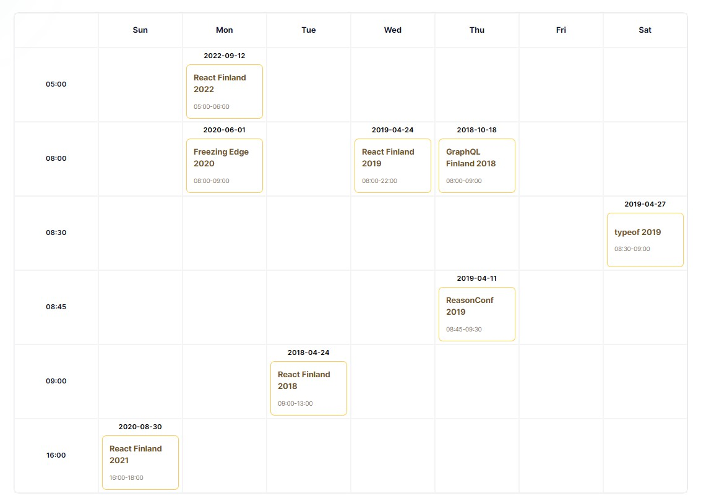

 </img>

<h1 align="center">Lemon Hive React-NextJs-Graphql Assesment</h1>

Welcome, here I've set up a project from scratch with create-next-app. My task was to implement a UI with core CSS or TailwindCSS, fetch data from GraphQL API and construct a dynamic schedule table using those data. When a user clicks on a schedule from schedule table it will route into a new page with additional information of a conference (Speaker details) and a sidebar which is rearrangeable by dragging and dropping! Every component is tested and mobile responsible.

"Please read the <i><a style="color:orange; text-decoration: underline;" href="#instruction">instructions</a></i> first"

 

<h2>Table of Contents</h2>
<ul>
<li>
  <a href="#instructions">
    Instructions
  </a>
  </li>
  <li>
    <a href="#technologies">
    Technologies That I Have Used
    </a>
  </li>
  <li>
    <a href="#folder-Structure">Folder Structure</a>
  </li>
  <li>
    <a href="#schedule-table">Dynamic Schedule Table</a>
  </li>
  <li>
  <a href="#drag-n-drop">
    Drag-n-drop
  </a>
  </li>
</ul>

 

  <h2>Instructions</h2>
  <ul>
    <li>Open terminal</li>
    <li>Clone this repository into your machine</li>
    <li>Change terminal working directory into project directory</li>
    <li>Run "npm install" to install all the dependencies locally </li>
    <li>Run "npm run test" to turn on Jest test environment and view the test results</li>
    <li>Run "npm run dev" to turn on Next.js development server</li>
    <li>Open Mozila Firefox browser or Google Chrome Browser and visit <a href="http://localhost:3000">http://localhost:3000</a></li>
    <li>I've already live hosted the project on Vercel, you can visit it here: <a href="https://lemonhive-assesment.vercel.app">https://lemonhive-assesment.vercel.app</a></li>
  </ul>

 
<!-- 

 -->

<h2>Technologies That I Have Used</h2>
<ul>
  <li>React.js</li>
  <li>Next.js</li>
  <li>TailwindCSS</li>
  <li>GraphQL</li>
  <li>Apollo Client</li>
  <li>React-beautiful-dnd</li>
  <li>Jest</li>
  <li>@testing-library/react</li>
</ul>

 

  <h2>Folder Structure</h2>
  

    <b style="font-size: 18px; min-width: 120px;">/components</b>
    
Here I stored all the reusable components of the projects

  

  

    <b style="font-size: 18px; min-width: 120px;">/configs</b>
    
Here I stored configurations of the projects

  

  

    <b style="font-size: 18px; min-width: 120px;">/graphQL</b>
    
Here I stored graphql queries of the projects

  

  

    <b style="font-size: 18px; min-width: 120px;">/pages</b>
    
Here I stored web applications static and dynamic pages

  

  

    <b style="font-size: 18px; min-width: 120px;">/public</b>
    
Here I stored all the static files such as pictures and svgs

  

  

    <b style="font-size: 18px; min-width: 120px;">/styles</b>
    
Here I stored CSS style sheet files of the project

  

  

    <b style="font-size: 18px; min-width: 120px;">/tests</b>
    
Here I've written test files of the project

  

 

  <h2>Dynamic Schedule Table</h2>
  

<!-- <h1 id="drag-n-drop">Drag and Drop</h1> -->
